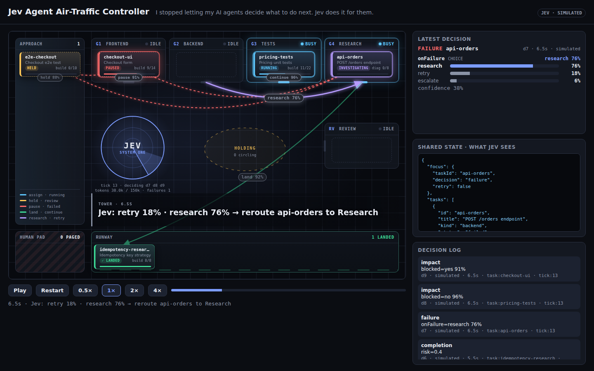
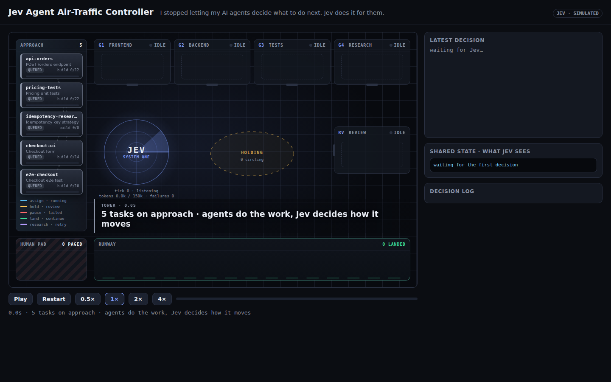
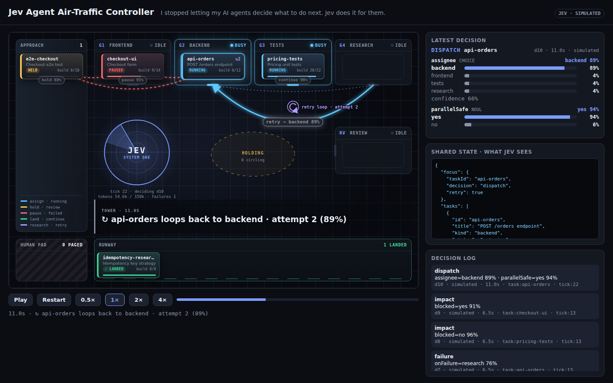
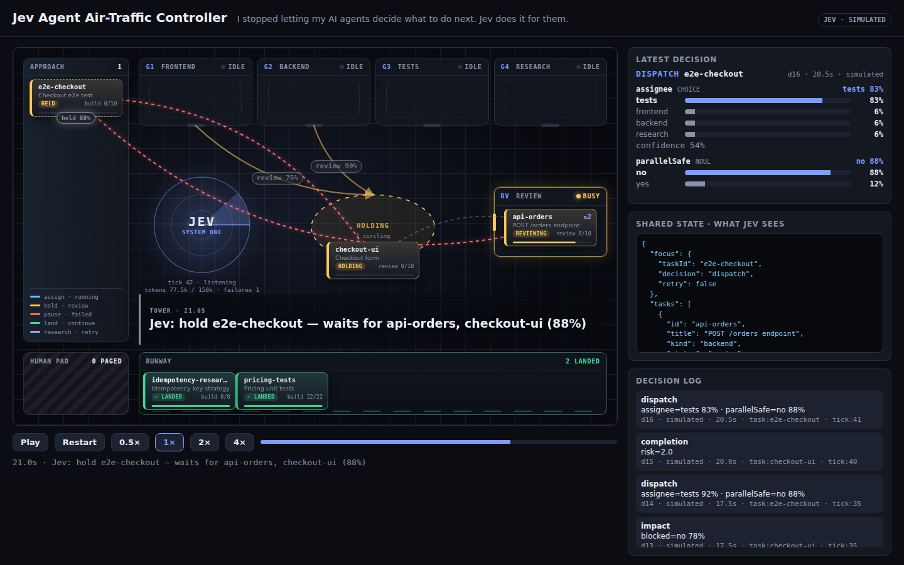
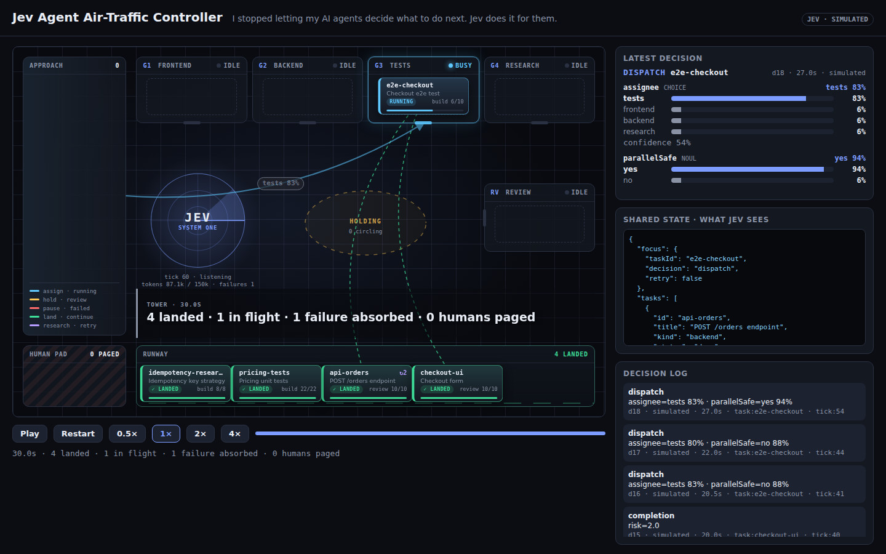

# Jev Agent Air-Traffic Controller

> **I stopped letting my AI agents decide what to do next. Jev does it for them.**

A control tower for five simulated coding agents (Frontend, Backend, Tests, Research, Review).
The agents only do the work. Every routing move is a typed question to **Jev** (TypeSafe System
One), and Jev answers each one with calibrated probabilities. The moves are: who takes a task,
whether it can start in parallel, what happens after a failure, whether a task is blocked, and
whether it needs review. An explicit policy with thresholds applies the answers. The tower draws
each move as a flight path with its probability on it, so the orchestration logic is on screen
instead of hidden in agent prompts.

- Spec: [SPEC.md](./SPEC.md) · Acceptance: [ACCEPTANCE.md](./ACCEPTANCE.md) · Plan: [WORKPLAN.json](./WORKPLAN.json)
- 30 s deterministic story (seed 7, 60 ticks × 500 ms, 18 Jev decisions). It is a pure function of the seed, so the same `?t=` always renders the same frame.



## Run

```bash
pnpm install                                   # once, at the repo root
pnpm --filter @jib-app/jev-agent-atc dev       # → http://localhost:3101
```

| URL | What you get |
|---|---|
| `http://localhost:3101/` | paused at 0 s, press **Play** |
| `http://localhost:3101/?autoplay=1` | plays the 30 s story from the start (use this to record) |
| `http://localhost:3101/?t=6500` | frozen on one frame (ms, clamped to 0…30000); add `&autoplay=1` to play from there |

Production build (use this to record, because it has no dev overlay):

```bash
pnpm --filter @jib-app/jev-agent-atc build
pnpm --filter @jib-app/jev-agent-atc start     # → http://localhost:3101
```

Checks: `pnpm verify jev-agent-atc` runs test-lock, acceptance coverage, typecheck, lint, 131
unit tests and 8 Playwright e2e tests.

## Live Jev

The **page** always uses the scripted simulated provider, so the recording is reproducible
(the badge reads `Jev · simulated`). The live swap happens at the **route** `POST /api/jev`,
which uses the same request shape the tower sends. It switches to the real TypeSafe System One
when a key is set:

```bash
# apps/jev-agent-atc/.env.local  (git-ignored, server-side only, never sent to the browser)
TYPESAFE_API_KEY=ts_...
# JEV_MODE=simulated   # forces the simulation even when a key is present (verify/e2e set this)
```

```bash
curl -s -X POST http://localhost:3101/api/jev -H 'content-type: application/json' -d '{
  "state": {
    "focus": { "taskId": "api-orders", "decision": "failure", "retry": false },
    "tasks": [{ "id": "api-orders", "title": "POST /orders endpoint", "kind": "backend",
                "status": "failed", "stage": "build", "agent": "backend", "progress": 0.92, "attempt": 1 }],
    "dependencies": [],
    "recentFailures": [{ "taskId": "api-orders", "agent": "backend", "attempt": 1, "kind": "logic",
                         "message": "duplicate key on POST /orders", "tick": 12 }],
    "changedFiles": { "api-orders": ["api/orders.ts", "db/schema.sql"] }
  },
  "questions": { "onFailure": { "type": "choice",
    "instruction": "The focus task just failed. What should happen next?",
    "criteria": { "retry": "Re-run the same agent as-is.",
                  "research": "Send to Research to diagnose, then retry with its findings.",
                  "escalate": "Stop and page a human." } } }
}'
# simulated → {"model":"jev-simulated","answers":{"onFailure":{"choice":"research",
#              "probabilities":{"retry":0.18,"research":0.76,"escalate":0.06},"confidence":0.3755,...}}}
```

With a key set, the same call returns System One's answer. Invalid bodies return 400 and
provider errors return 502. The key is only read in `@jib/jev/server`, and no client module
imports it.

## Architecture

```
app/page.tsx            server component: runScenario() once → <ControlTower run …/>
app/api/jev/route.ts    POST /api/jev → live TypeSafe or the ATC simulation
src/domain/             types.ts (contract) · engine.ts: pure tower state machine
                        (advanceWork → decisionsNeeded → applyActions → startAssigned)
src/jev/                questions.ts (5 System One questions) · state.ts (TowerState → JevState)
                        policy.ts (POLICY thresholds + rule-based fallbacks) · resolvers.ts
                        (scripted simulated answers, seeded) · decide.ts (ask → interpret)
src/scenario/           config.ts (5 tasks, 3 dependencies) · run.ts (virtual clock, 60 ticks
                        → frames + decision records) · captions.ts · params.ts (?t / ?autoplay)
src/components/         ControlTower (client player) · TowerCanvas (gates, cards, edges, lanes,
                        holding pattern, retry loop, runway) · DecisionSpotlight / SharedStatePanel
                        · selectors.ts / layout.ts (pure, unit-tested)
```

| Decision | Question · type | Policy |
|---|---|---|
| `dispatch` | `assignee` · choice + `parallelSafe` · noul | assign if P(agent) ≥ 0.5 (else the task's own kind, flagged fallback) and parallelSafe ≥ 0.6, else hold |
| `failure` | `onFailure` · choice (retry / research / escalate) | research → reroute, retry → retry; escalate if P < 0.45 or attempt ≥ 3 |
| `impact` | `blocked` · noul | ≥ 0.5 → pause, else continue / resume |
| `completion` | `risk` · score (trivial…high) | P(medium) + P(high) ≥ 0.5 → review, else land |

Shared packages: `@jib/jev` (createJev, question builders, simulated provider, route handler),
`@jib/demo-kit` (virtual clock, timeline), and `@jib/ui` (DemoShell, ScenarioControls,
useScenarioPlayer, ProbabilityBars, DecisionLogPanel). The UI imports only domain *types*.

## 30 s recording script

Record `http://localhost:3101/?autoplay=1` in a 1440×900 window, using the production build. For
a phone-sized post, crop to the tower canvas and the "Latest decision" panel. The caption strip
carries the story.

| t | Beat | What to point at |
|---|---|---|
| 0.0 s | Intro | 5 cards on **Approach**, all gates idle, the caption shows the premise |
| 0.5–2.0 s | Dispatch cascade | each card flies to its gate with a badge (`backend 86%`, `tests …`). `checkout-ui` starts early on the API *contract* |
| 2.5 s | Hold | `e2e-checkout` **hold 88%**, and two red dashed dependency lanes appear |
| 3.0 s | Parallel | 4 gates busy |
| 5.5 s | Land | `idempotency-research` land 92% → runway, no review |
| 6.0 s | Failure | backend card flashes red: `✗ api-orders failed on backend — duplicate key on POST /orders` |
| **6.5 s** | **Re-route (the money shot)** | bars read `retry 18% · research 76% · escalate 6%`. `api-orders` → Research, `checkout-ui` **pause 91%**, `pricing-tests` **continue 96%** |
| 11.0 s | Retry loop | `retry → backend 89%`, retry-loop graphic, `↻2` on the card |
| 17.0 s | Review | `api-orders` review 90% → review gate, and `checkout-ui` resumes |
| 20–22 s | Holding pattern | `checkout-ui` review 75% circles in **Holding** while review is busy |
| 27.0 s | Clearance | `checkout-ui` lands, and `e2e-checkout` → tests |
| 29–30 s | Summary | `4 landed · 1 in flight · 1 failure absorbed · 0 humans paged` |

Stills: `?t=2500` (hold + lanes), `?t=6500` (re-route), `?t=11000` (retry loop),
`?t=21000` (holding pattern).

## Screenshots (1440×900)

| | |
|---|---|
|  `?t=0` intro |  `?t=6500` re-route |
|  `?t=11000` retry loop |  `?t=21000` holding pattern |
|  `?t=30000` summary | |

## Draft X post

> I stopped letting my AI agents decide what to do next. Jev does it for them.
>
> 5 agents, 1 control tower. Every routing move is a typed question with a probability on it.
> Backend fails → retry 18%, research 76% → the board re-routes itself: the fix goes to Research,
> the dependent UI pauses, and the unrelated tests keep flying.
>
> No orchestration logic hidden in prompts. Just thresholds you can read. (thread)

Thread: (1) the 5 questions × 3 System One types · (2) the JSON shared state Jev sees
(screenshot of the Shared state panel) · (3) thresholds and fallbacks, so there is no hidden
prompt logic · (4) simulated first, then live System One through one route.
