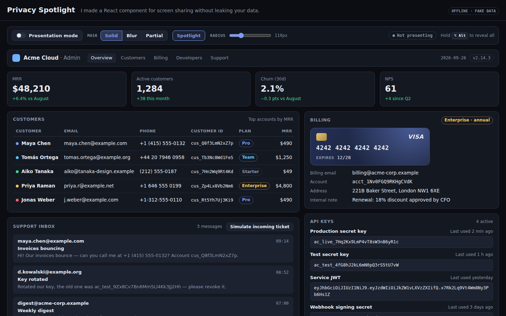
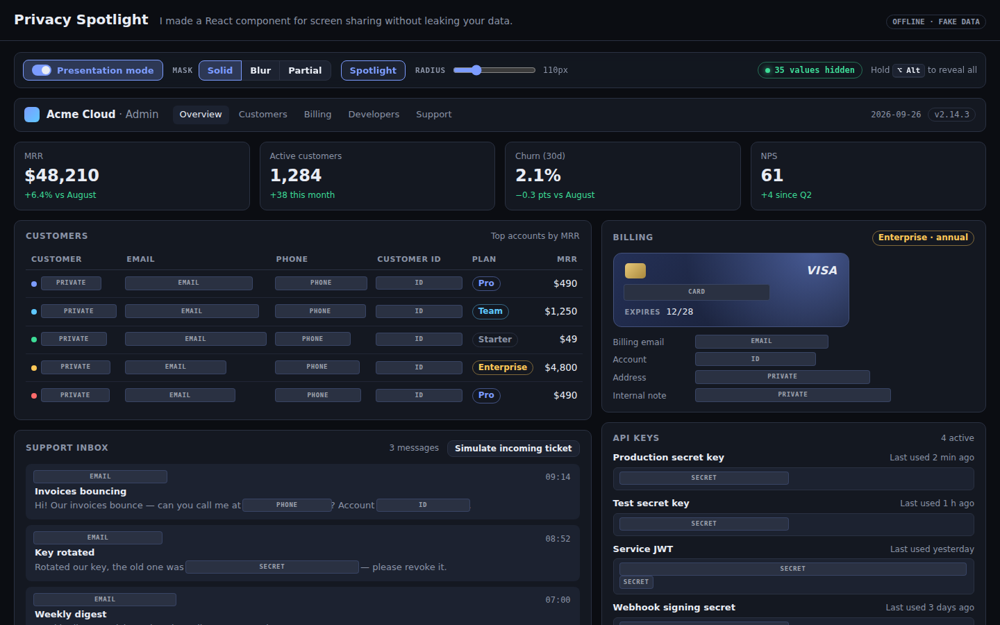
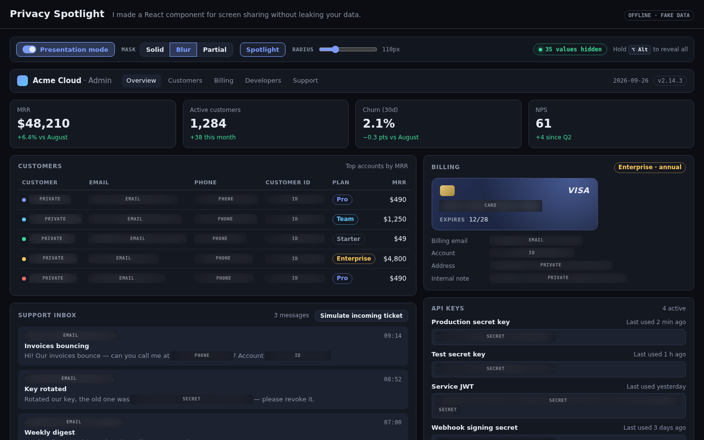
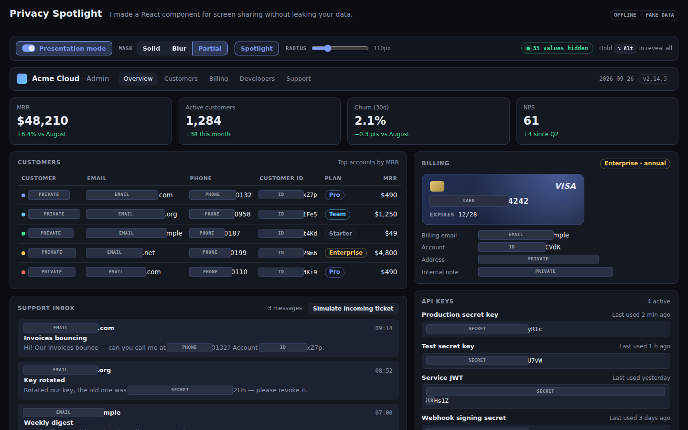
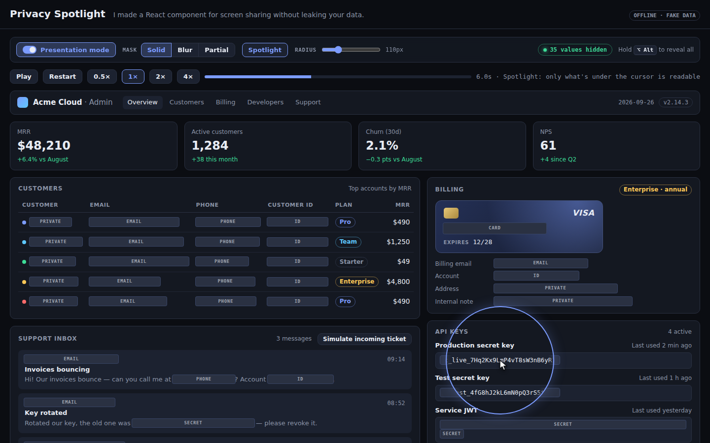
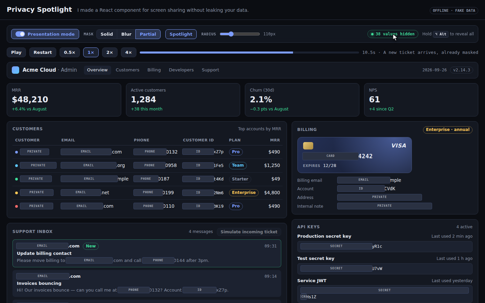

# Privacy Spotlight

> **I made a React component for screen sharing without leaking your data.**

`<PrivacySpotlight>` is a React wrapper for screen sharing and recording. Turn on **Presentation
mode** and it finds the sensitive values inside its subtree, then paints one overlay of labelled
masks exactly over their pixels. Values are found through explicit `data-sensitive` markers and 5
detectors (email, phone, API token, account/customer ID, payment card). A round **spotlight**
follows your cursor, so only the value you point at is readable. Hold **⌥ Alt** to reveal
everything while the key is down. The masks follow live data: a new support ticket shows up
already masked.

- Spec: [SPEC.md](./SPEC.md) · Acceptance: [ACCEPTANCE.md](./ACCEPTANCE.md) · Plan: [WORKPLAN.json](./WORKPLAN.json)
- The demo runs offline on obviously fake data (`example.com` addresses, 555-01xx numbers, the Stripe
  test card `4242…`, a fictional `ac_live_` key prefix).

## Threat model: pixels only

Read this before you rely on it.

- **What it protects:** the pixels that leave your machine through a screen share, a recording or a
  screenshot.
- **What it does not protect:** the data itself. The values stay in the DOM and in the accessibility
  tree. They also stay available to copy/paste, devtools, network responses and browser extensions.
  Anyone with access to the page can still read them.
- **Reveals are real disclosure.** The spotlight and hold-to-reveal show real pixels to your
  audience. Use them on purpose. They are not a private peek.
- **Blur is cosmetic.** Short values (digits, codes) can be recovered from a blur. Use **Solid**
  (the default) on real calls.
- **Known gaps in v1:**
  - text split across several text nodes
  - values inside `<input>` / `<textarea>`
  - canvas, images and video (unless marked with `data-sensitive`)
  - portals rendered outside the wrapper
  - inner scroll containers (masks are not clipped)
  - a possible one-frame lag after layout changes (resize, scroll, font load)
- **Fail-closed:** new or changed DOM content is masked **before the next paint**. A
  `MutationObserver` rescans and commits with `flushSync`. Wrapping something defaults to
  `presenting: true`.
- A web page cannot know it is being shared. Masking starts with an explicit toggle or prop.
  "Automatic" means *which* values get masked, not *when*.

## Usage

```tsx
import { PrivacySpotlight } from "@/spotlight";

export function AdminPage() {
  return (
    <PrivacySpotlight>
      <Dashboard />
      {/* Names and addresses are not auto-detected: mark them. */}
      <span data-sensitive>Maya Chen</span>
      {/* Opt a subtree out of detection (data-sensitive inside it still wins). */}
      <pre data-privacy-ignore>{logs}</pre>
    </PrivacySpotlight>
  );
}
```

Controlled, driven by your own toolbar (this is what the demo does):

```tsx
const controller = usePrivacySpotlight({ presenting: false, maskStyle: "solid" });
// controller.dispatch({ type: "togglePresenting" }) · { type: "setMaskStyle", value: "partial" }
// { type: "setSpotlight", value: false } · { type: "setRadius", value: 160 }

<PrivacySpotlight controller={controller} onTargetsChange={(t) => setHidden(t.length)}>
  <Dashboard />
</PrivacySpotlight>;
```

Props: `controller` or `initial` (partial state), `detectors` (subset of
`email | phone | token | account | card`), `padding`, `onTargetsChange`, `className`.

### Mask styles and reveal

| Mask style | What the audience sees |
|---|---|
| `solid` (default) | opaque mask labelled `EMAIL`, `PHONE`, `SECRET`, `ID`, `CARD` or `PRIVATE` |
| `blur` | frosted glass. Cosmetic: short values can leak |
| `partial` | everything but the last 4 characters is masked (`•••• 4242`). Values shorter than 8 characters are masked fully |

The two reveal methods combine with every style:

- **Spotlight** (toggle, radius 40–320 px): a round hole around the cursor. Only the masks under it
  open.
- **Hold ⌥ Alt**: reveals every mask while the key is held. Releasing the key, blurring the window
  or hiding the tab masks everything again.

### Detectors (low false positives)

| Kind | Matches | Stays readable |
|---|---|---|
| email | `maya.chen@example.com` | `@maya`, `user@localhost` |
| phone | `+1 (415) 555-0132`, `(212) 555-0187` | `555-0132`, `192.168.0.1`, dates |
| token | `ac_live_…`, `ghp_…`, `AKIA…`, JWTs, 32+ char mixed-case strings with ≥ 4 digits | UUIDs, hex hashes, `camelCaseIdentifiers` |
| account | `cus_Q8f3LmN2xZ7p`, `acct_…`, `ACCT-0048213` | `cus_short`, `in_progress` |
| card | 13–19 digits, IIN 2–6, **Luhn valid** | `4242 4242 4242 4241`, timestamps, prices |

## Run

```bash
pnpm install                                        # once, at the repo root
pnpm --filter @jib-app/privacy-spotlight dev        # → http://localhost:3108
```

| URL | What you get |
|---|---|
| `/` | readable dashboard with the toolbar. Click **Presentation mode** |
| `/?present=1` | starts presenting (35 values masked) |
| `/?present=1&mode=blur` | frosted masks (`mode=solid\|blur\|partial`) |
| `/?present=1&mode=partial&spotlight=0&radius=160` | partial masks, spotlight off, radius 160 px (clamped to 40–320) |
| `/?tour=1&autoplay=1` | the 15 s scripted tour, played hands-free with a ghost cursor |
| `/?tour=1&t=4500` | the tour paused on one frame (ms, 0–15000). The same `t` always gives the same frame |

With `?tour=1`, the tour's first frame overrides `present` and `mode`.

Checks: `pnpm verify privacy-spotlight` (test lock, acceptance coverage, typecheck, lint, unit, e2e).

Live Jev: not applicable. This project makes no probabilistic decision (SPEC §5), so it has no
`app/api/jev` route and nothing to switch. It always runs offline on static fake data.

## Record the 15 s demo

Use the production build (it has no dev overlay):

```bash
pnpm --filter @jib-app/privacy-spotlight build
pnpm --filter @jib-app/privacy-spotlight start      # → http://localhost:3108
```

Open `http://localhost:3108/?tour=1&autoplay=1` at **1440×900** and record 15 s. The real cursor
is hidden while the tour runs, and the ghost cursor drives the spotlight.

| t (s) | What happens |
|---|---|
| 0.0 | full dashboard, all fake PII readable, toolbar says "Not presenting" |
| 1.0–1.7 | ghost cursor glides to **Presentation mode** |
| 2.0 | 35 values masked in one frame (`35 values hidden`). KPIs, plans and prices stay readable |
| 3.0–3.7 | cursor glides onto Tomás's email. The spotlight makes only that spot readable |
| 5.0–5.7 | cursor glides to the production secret key. The key is readable, its neighbours stay masked |
| 7.0 | **Blur** mode (cosmetic). The spotlight still reveals the key |
| 8.5 | **Partial** mode. The cursor leaves for the toolbar. Cards show `•••• 4242`, keys end `yR1c` |
| 10.0 | a new support ticket arrives, already masked (`38 values hidden`) |
| 11.5 | hold ⌥ Alt: every mask disappears, the hint lights up |
| 13.0 | release: masks are back |
| 14.0 | Presentation mode off |

For a "real hands" cut, open `/`, use your own mouse and follow the same beats.
Stills: `/?tour=1&t=4500` (spotlight on a row), `/?tour=1&t=9500` (partial `•••• 4242`),
`/?present=1&mode=blur` (frosted).

## Screenshots

Production build, 1440×900, headless Chromium. Files are in
[`docs/screenshots/`](./docs/screenshots/).

| | URL | What it shows |
|---|---|---|
|  | `/` | the dashboard before Presentation mode: all fake PII is readable |
|  | `/?present=1&mode=solid` | 35 labelled opaque masks. KPIs, plans, prices, dates and version stay readable |
|  | `/?present=1&mode=blur` | frosted masks (cosmetic) |
|  | `/?present=1&mode=partial` | only the last 4 characters stay visible (`4242`, `yR1c`, `.com`) |
|  | `/?tour=1&t=6000` | the ghost cursor on the production secret key. Only the circle is readable |
|  | `/?tour=1&t=10500` | partial mode, the new ticket arrived already masked, `38 values hidden` |

To regenerate them, start the production build and capture the same URLs at 1440×900.

## Draft X post

> I made a React component for screen sharing without leaking your data.
> Wrap your app and hit Presentation mode: emails, phones, API keys, card numbers and customer IDs
> get masked in the same frame. Point at one value and only that spot becomes readable. Hold ⌥ to
> reveal all.

Thread:

1. The API: `<PrivacySpotlight><Dashboard/></PrivacySpotlight>` plus `data-sensitive`.
2. Detectors: Luhn for cards, ≥ 4 digits + mixed case for secrets, so dates, versions, prices and
   UUIDs stay readable.
3. The backdrop-root gotcha: a `mask-image` on the overlay would stop child `backdrop-filter`
   blurs, so the spotlight hole lives on each mask.
4. Honest threat model: pixels only. Values stay in the DOM, and blur is cosmetic.
5. Fail-closed: `MutationObserver` + `flushSync` masks new data before it is painted.

## Architecture

```
src/core/        pure TS: detectors, geometry, reducer, computeOverlay, parseDemoParams
src/spotlight/   the reusable component: DOM scanner, <PrivacySpotlight>, usePrivacySpotlight
src/demo/        fake SaaS dashboard + toolbar (demo only)
src/scenario/    the 15 s tour timeline (@jib/demo-kit) and ghost-cursor waypoints
src/components/  DemoApp (page wiring) + TourDriver (player, sync, ghost cursor)
app/page.tsx     server page: parses the query, renders DemoShell + DemoApp
```

`src/core` + `src/spotlight` have no dependency on the demo, so they can be extracted into a
package later.
